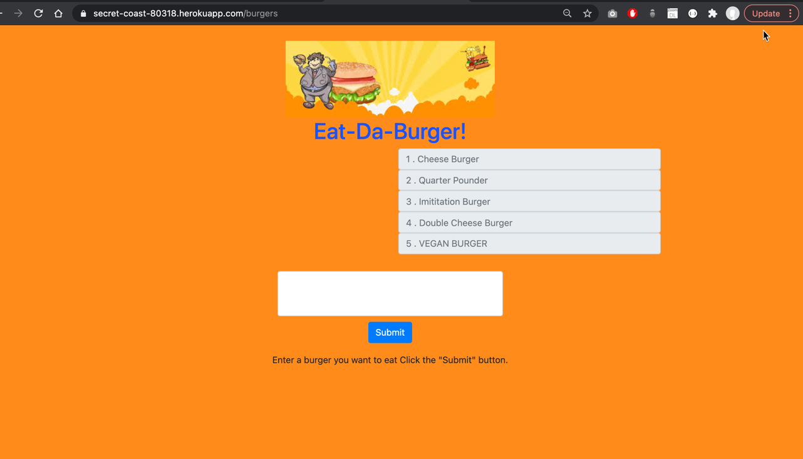

# node-express-handlebars
## Description 
   
Eat-Da-Burger is an app that simulates the status of eating burger at a restaurant. A user can add a burger of their choice and it gets added to the database, similar to ordering the fodd at a restaurant. After the food is ordered and it appears on the first column, devour option appears next to the burger. User can click the devour button to mimic the eating or burger. Once burger is devoured, it appears on the list of devoured burgers on right. 


 
## Heroku Deploymet:
This app is also deployed in heroku. Please click this link to view the  [Deployed App](https://secret-coast-80318.herokuapp.com/burgers) in heroku.

  ## Table of Contents
  * [Technologies Used](#technologies)
  * [Installation](#installation)
  * [Usage](#usage)
  * [Contributing](#contributing)
  * [Tests](#tests)
  * [License](#license)
  
  ## Technologies
  MySQL, Express, Node, and Handlebars as well as Javascript, HTML, CSS, Bootstrap, jQuery
  
  ## Installation
    
Clone the repository to your local development environment.

```
git clone https://github.com/binayaluitel2/node-express-handlebars.git
```
Navigate to the node-express-handlebars folder using the command prompt.

Run `npm install` to install all dependencies.

Navigate to the config folder and update connection.js file with correct password. 

Then, run `node server.js` to start the application. 

Once the application is start please follow the video demo below to order and devour the burger.

  ## Usage 
    
  
  
  ## Contributing
  
  Binaya Luitel
  
  ## Tests  
  
 None
  
  ## License
  
  MIT License
  
